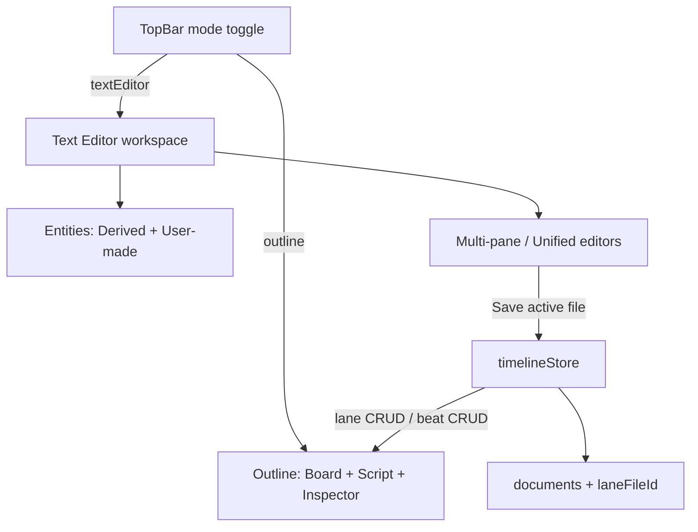

# Text Editor Workspace Mode (Phase 1)

## Overview

Promote Beat Text Editor into a first-class Outline / Text Editor mode toggle, with derived per-lane files (ID-line beat templates, save-gated sync), user-made files + Convert to Lane, multi-pane side-by-side and unified scroll — extending `TimelineDocumentRecord` and `timelineStore` without touching Outline board/inspector/script behavior.

## Decisions (locked)

- **Beat ID line:** each existing block starts with `id: <beatId>`; new blocks omit it until Save assigns an ID.
- **Mode switch with dirty drafts:** allow Outline ↔ Text Editor; keep drafts in memory. Outline always shows last committed store model. Returning to Text Editor restores open panes + drafts.
- **Empty block with only `id:`:** hard Save error — require a non-empty `Title:` (do not wipe beat content silently).

## Hard Save errors (surface, keep draft, no commit)

- Missing / empty `Title:` (including id-only blocks)
- Duplicate `id:` in one file
- `id:` not on this derived lane / unknown beat
- Malformed separator structure that cannot yield clean blocks
- Unknown field labels inside a block (e.g. `Foo:`)

## Architecture



Outline mode keeps current [`TimelineBoard`](src/components/timeline/TimelineBoard.tsx) / Inspector / Script pane. Text Editor mode replaces the center stack (board + script) only — Entities stays; Inspector stays closed/hidden in text mode (same as today when beat editor is open).

## Data model extensions

Extend [`TimelineDocumentRecord`](src/storage/StorageDriver.ts) (and load/save paths in [`timelineStore.ts`](src/store/timelineStore.ts)):

```ts
interface TimelineDocumentRecord {
  id: string;
  name: string;
  content: string;
  updatedAt: number;
  kind: "user" | "derived";  // default "user" for legacy docs
  laneId?: string;             // set when kind === "derived"
}
```

On lane create / load: ensure one derived doc per lane (`kind: "derived"`, `laneId`, `name` = lane label). Regenerating content from beats only when opening a file that has **no dirty draft**.

Add session (non-persisted) workspace state on the store or screen:

- `workspaceMode: "outline" | "textEditor"`
- `openFileIds: string[]`, `activeFileId`, pane width fractions, `unifiedScroll: boolean`
- `fileDrafts: Record<docId, { content: string; dirty: boolean }>` — survives mode switch
- Soft-delete pending confirm for emptied derived file: `pendingLaneDeleteDocIds`

## Beat template format (generate + parse)

New module [`src/components/timeline/beatEditor/laneFileFormat.ts`](src/components/timeline/beatEditor/laneFileFormat.ts) (reuse field helpers from [`beatDocumentModel.ts`](src/components/timeline/beatEditor/beatDocumentModel.ts)):

**Generate** (slot order):

```text
id: _abc123
Title: Opening Scene
Synopsis: ...
Detail: ...
Date: ...
- - - - - -
```

Date line serializes a readable form from `BeatDateSpec` (label/resolved text, or absolute ISO; relative as human string). Parse maps `Date:` via existing `dateSpecFromResolvedText` / empty.

**Parse:** split on separator lines; each block optional `id:` then required labeled fields. Return `{ beats: ParsedBlock[], errors: string[] }`.

## Store actions (extend, don’t fork)

Add to [`timelineStore.ts`](src/store/timelineStore.ts):

- `ensureDerivedDocuments()` — sync derived docs to lanes (create missing; rename with lane label; remove derived docs whose lane is gone when Outline deleted the lane)
- `regenerateDerivedContent(laneId)` — overwrite doc content from beats (only when no draft dirty)
- `saveDerivedLaneFile(docId, content)` — parse → update/create/remove beats on that lane via existing `updateBeat` / `importBeats` / `removeBeats`; empty file → confirm then `removeLane`
- `convertUserDocumentToLane(docId, content)` — parse hard-errors → `addLane` → create beats → set doc `kind: "derived"` + `laneId`
- `createUserDocument(name?)` — user-made empty or template stub
- Fix autosave snapshot to include `documents` (and prefixes) so document-only Saves aren’t stranded

Save of derived file that is empty / deleted: Modal confirm “Delete lane X and all its beats?” then `removeLane`.

## UI changes

### Mode toggle — [`TimelineScreen.tsx`](src/screens/TimelineScreen.tsx)

- Replace transient `beatEditorOpen` with `workspaceMode`.
- TopBar: **Outline | Text Editor** toggle.
- Outline: existing board + script + inspector wiring unchanged.
- Text Editor: new workspace shell; hide Outline toolbar/script/inspector; Entities in Files view.

### Text Editor workspace (rewrite/replace [`BeatTextEditorPanel.tsx`](src/components/timeline/beatEditor/BeatTextEditorPanel.tsx))

Promote into `TimelineTextEditorWorkspace.tsx`:

- **Main toolbar** (single): New file, Insert beat template, Save (active file), Convert to Lane (active user-made only), Unified scroll toggle, dirty indicator for active file.
- **Panes:** open files as columns with draggable dividers; each pane = CodeMirror via existing [`BeatDocumentEditorView`](src/components/timeline/beatEditor/BeatDocumentEditorView.tsx); click/focus sets `activeFileId`.
- **Unified scroll:** one column, stacked sections (file name headers), same open set; cursor position determines active file for toolbar actions.
- Drop “Back to Outliner” / Create beats / lane picker — mode toggle + Convert replace that flow. Keep paste auto-separators + insert template.

### Entities — [`TimelineEntitiesPanel.tsx`](src/components/timeline/TimelineEntitiesPanel.tsx)

In Text Editor mode, Files view:

1. **Derived** — one row per derived doc (lane name + dirty badge); click opens/focuses pane.
2. **User-made** — freeform docs; New file; click open; delete (with confirm if dirty).

Outline mode Entities (Lanes → Beats) unchanged.

### Toolbar cleanup — [`TimelineToolbar.tsx`](src/components/timeline/TimelineToolbar.tsx)

Remove or hide “Beat Text Editor” button when mode toggle lives in TopBar.

## Migration

- Existing `documents` without `kind` → `kind: "user"`.
- On entering Text Editor / load: `ensureDerivedDocuments()` creates derived files for current lanes from beats.

## Out of scope (phase 1)

- Changing Outline board, inspector, or script pane behavior.
- Family Tree / Profiles.
- Bidirectional live preview while typing (Save-gated only).
- Renaming lanes from derived file name (name follows lane label from store for now).

## Verification

- Create lane in Outline → Text Editor shows Derived file with beats + `id:` lines.
- Edit title, Save → Outline reflects; dirty draft without Save does not.
- Append template without `id:`, Save → new beat + ID written back into draft/content.
- Delete one block, Save → beat + crossings removed.
- Clear file, Save → confirm → lane deleted.
- User-made file → Convert to Lane → moves to Derived with beats.
- Hard errors: id-only block, duplicate id, unknown field — Save blocked, draft kept.
- Mode switch with dirty draft → Outline unchanged; return → draft still there.
- Side-by-side + unified toggle restore same open files.

## Todos

1. Extend `TimelineDocumentRecord` (kind/laneId); `ensureDerivedDocuments`; migrate legacy docs; include documents in autosave snapshot
2. Add `laneFileFormat` generate/parse with `id:` line + hard error rules
3. Store actions: `saveDerivedLaneFile`, `convertUserDocumentToLane`, `createUserDocument` + lane-delete confirm path
4. `TimelineScreen` Outline | Text Editor mode; draft memory across switches; hide Outline chrome in text mode
5. Text Editor workspace: toolbar, multi-pane dividers, unified scroll, active-file actions
6. Entities Files view: Derived + User-made sections wired to open panes
7. Verify save-gated sync, convert, delete confirm, hard errors, layout toggles
